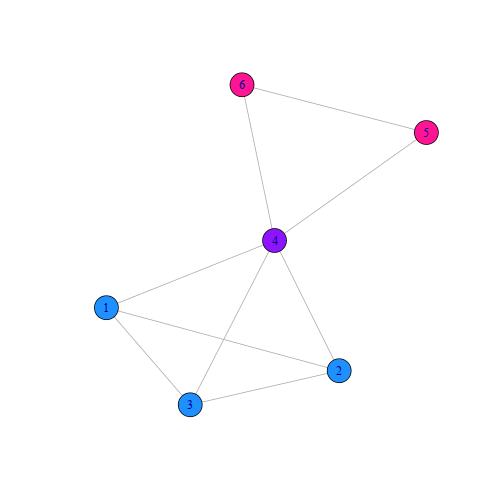

% Network Measures and Metrics II
% Keith Hughitt
% 2014/03/12

Network Measures and Metrics II
===============================

Outline
-------

These notes cover the following sections of MEJN:

1. Groups of Vertices (7.8)
2. Transitivity (7.9)
3. Reciprocity (7.10)
4. Signed Edges and Structural Balance (7.11)

7.8 Groups of Vertices
----------------------

Some basic methods of defining a "group" in a network; more advanced methods of
group detection (clustering, etc.) are discussed in later sections in the book.

## 7.8.1 Cliques, Plexes, and Cores

### Cliques

> A *clique* is a maximal subset of the vertices in an *undirected* network 
> such that every member of the set is connected by and edge to every other.

Example:

<pre class="knitr r"># load igraph and set random seed
library(igraph)
set.seed(1)

# adj matrix with two cliques
clique = matrix(0, 6, 6)
clique[0:4,0:4] = 1
clique[3,4] = clique[4,5] = clique[4,5] = clique[4,6] = clique[5,6] = 1
diag(clique) = 0

# plot cliques
plot(graph.adjacency(clique, mode='undirected'))
</pre>

- In the above figure, nodes 1-4 and 4-6 each form separate cliques
- Cliques can overlap.
- Most stringent approach to finding groups in networks.

### *k*-plexes

> A *k*-plex of size *n* is the maximal subset of *n* vertices within a network
> such that each vertex is connected to at least *n - k* of the others.

- *k*-plexes are a relaxed version of the concept of a clique.
- If *k*=1, then you are back at the definition of a clique
- Nodes in a *k*-plex must be connected to at least *k*-1 other nodes in the
  *k*-plex.
- Example: a group of friends in a social network where most people know most
  other people in the network.
- *k*-plexes can overlap.
- MEJN: possible useful generalization -- require each member be connected to
  some *fraction* of the other members.

### *k*-cores

> A *k*-core is a maximal subset of vertices such that each is connected to at
> least *k* others in the subset.

- Similar to *k*-plex idea except that minimum number of connections required
  is defined as a hard value, irrespective of the size of the group.
- A *k*-core with *n* vertices is the same as a (*n-k*)-plex
- *k*-cores *cannot* overlap; overlapping *k*-cores can be combined into one.

### *k*-cliques

> A *k-clique* is a maximal subset of vertices such that each is no more than a
> distance *k* away from any of the others via the edges of the network.

- This is a generalization to the distance of the relationships between nodes.
- *k*=1 is just an ordinary clique

### *k*-clans / *k*-clubs

- *k*-cliques do not necessarily produce sub-networks where all of the nodes
  are connected by a path to one another (see example in book on p196).
- *k-clans* and *k-clubs* are two modified versions of this definition which
  impose restrictions on the connectivity of the sub-groups.

## 7.8.2 Components and *k*-Components

> A *k-component* (or *k-connected component*) is a maximal subset of vertices
> such that each is reachable from each of the others by at least *k*
> vertex-indepedent paths.

- *vertex-independent paths* are paths which share none of the same vertices
  except for the start and end (also, recall that the number of
  vertex-independent paths between two nodes equals the size of the vertex cut
  set between those nodes.)
- This is generalization of the idea of a *component* or *connected component*
- *k*-components are related to the concept of network robustness (relates to
  the number of nodes that would have to be removed for two nodes to become
  disconnected)
- Social network lit. sometimes uses slightly modified definition to exclude
  non-contiguous sets of *k*-components.

References
----------
- M.E.J. Newman, (2010) Networks: An Introduction
