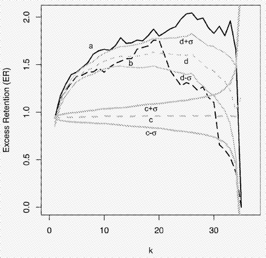
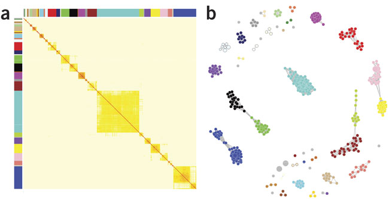
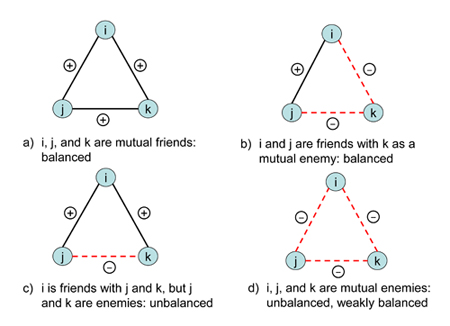

Network Measures and Metrics II
===============================
Keith Hughitt
2014/03/12

Outline
-------

These notes cover the following sections of
[MN](http://www-personal.umich.edu/~mejn/networks-an-introduction/):

1. Groups of Vertices (7.8)
2. Transitivity (7.9)
3. Reciprocity (7.10)
4. Signed Edges and Structural Balance (7.11)

Afterwards, a comparison between some of these approaches and other commonly
used clustering methods is made.

Setup
-----

Before getting started, let's load all of the libraries that will be used
throughout this text.

```{r load_libraries}
library(knitr)
library(igraph)
library(DREAM4)
library(RColorBrewer)
library(RBGL)
library(ggplot2)
library(reshape2)

# set knitr default figure size
opts_chunk$set(fig.width=1024/96, fig.height=1024/96, fig.dpi=96)

# set random seed
set.seed(1)
```

# load igraph and set random seed

7.8 Groups of Vertices
----------------------

Some basic methods of defining a "group" in a network; more advanced methods of
group detection (clustering, etc.) are discussed in later sections in the book.

## 7.8.1 Cliques, Plexes, and Cores

### Cliques

> A *clique* is a maximal subset of the vertices in an *undirected* network 
> such that every member of the set is connected by and edge to every other.

#### Example: cliques {igraph}

```{r clique}

# restore default igraph options
igraph.options(vertex.size=NULL, vertex.label=NULL, edge.arrow.size=NULL)

# adj matrix with two cliques
adj.matrix = matrix(0, 6, 6)
adj.matrix[1:4,1:4] = 1
adj.matrix[3,4] = adj.matrix[4,5] = adj.matrix[4,5] = adj.matrix[4,6] = adj.matrix[5,6] = 1
diag(adj.matrix) = 0

# print adjacency matrix
adj.matrix

# convert to graph
g = graph.adjacency(adj.matrix, mode='undirected')

# plot graph
plot(g)

# find all cliques
g.cliques = maximal.cliques(g)

# plot first clique matched
V(g)$color = ifelse(V(g) %in% g.cliques[[1]], '#FF1493', '#7EC0EE')
plot(g)

# plot second clique matched
V(g)$color = ifelse(V(g) %in% g.cliques[[2]], '#FF1493', '#7EC0EE')
plot(g)
```

- In the above figure, nodes 1-4 and 4-6 each form separate cliques
- Cliques can overlap.
- Most stringent approach to finding groups in networks.

### *k*-plexes

> A *k*-plex of size *n* is the maximal subset of *n* vertices within a network
> such that each vertex is connected to at least *n - k* of the others.

- *k*-plexes are a relaxed version of the concept of a clique.
- If *k*=1, then you are back at the definition of a clique
- Nodes in a *k*-plex must be connected to at least *k*-1 other nodes in the
  *k*-plex.
- Example: a group of friends in a social network where most people know most
  other people in the network.
- *k*-plexes can overlap.
- MN: possible useful generalization -- require each member be connected to
  some *fraction* of the other members.

### *k*-cores

> A *k*-core is a maximal subset of vertices such that each is connected to at
> least *k* others in the subset.

- Similar to *k*-plex idea except that minimum number of connections required
  is defined as a hard value, irrespective of the size of the group.
- A *k*-core with *n* vertices is the same as a (*n-k*)-plex
- *k*-cores *cannot* overlap; overlapping *k*-cores can be combined into one.

#### Example: graph.coreness {igraph}

```{r kcores}
g.kcores = graph.coreness(g)

# color 3-cores orange
V(g)$color = ifelse(g.kcores == 3, '#FF6666', '#1E90FF')
plot(g)
```

#### Example: Robustness of *k*-core enrichment


(Wachi et al. 2005)

Washi et al (2005), looked at the enrichment of differentially expressed genes
(DEG) in the *k*-cores of a network for successively larger values of *k*. They
found that up-regulated (a) and down-regulated (b) genes were significantly
enrichmed in the higher valued *k*-cores compared to random groups of genes of
the same size.

#### Example: Visualization of protein-interaction data


(Bader & Hogue, 2002)

In the above example, *k*-core filtering is used to highlight interesting
clustering of interacting yeast proteins. For parts A-C, k=6 (different
datasets used in each case), while for D, k=9.

### *k*-cliques

> A *k-clique* is a maximal subset of vertices such that each is no more than a
> distance *k* away from any of the others via the edges of the network.

- This is a generalization to the distance of the relationships between nodes.
- *k*=1 is just an ordinary clique

#### Example: Finding significant interactions in yeast PPI data


(Zhu et al, 2008)

In the above example from Zhu et al. (2008), *k*-cliques with k>=5 are found
for a yeast protein-protein interaction (PPI) dataset, and then grouped
together to form "clique communities". These groups of cliques were found to
correlate between with co-expression data and provide better indicators of
actual interacting proteins. Each node in the above figure depicts a single
*k*-clique.


### *k*-clans / *k*-clubs

- *k*-cliques do not necessarily produce sub-networks where all of the nodes
  are connected by a path to one another (see example in book on p196).
- *k-clans* and *k-clubs* are two modified versions of this definition which
  impose restrictions on the connectivity of the sub-groups.

## 7.8.2 Components and *k*-Components

> A *k-component* (or *k-connected component*) is a maximal subset of vertices
> such that each is reachable from each of the others by at least *k*
> vertex-indepedent paths.

- *vertex-independent paths* are paths which share none of the same vertices
  except for the start and end (also, recall that the number of
  vertex-independent paths between two nodes equals the size of the vertex cut
  set between those nodes.)
- This is generalization of the idea of a *component* or *connected component*
- *k*-components are related to the concept of network robustness (relates to
  the number of nodes that would have to be removed for two nodes to become
  disconnected)
- Social network lit. sometimes uses slightly modified definition to exclude
  non-contiguous sets of *k*-components.

7.9 Transitivity
----------------

## Overview

Transitive relations (math):
- if A ○ B, and B ○ C, then A ○ C
- e.g. equality operator

In some cases, various relations on the vertices of a network may be
transitive.
- Ex. "connected by an edge"
- Networks showing this property are themselves said to be *transitive*
- "Perfect transitivity" ⇒ Each network component is fully connected
- "Partial transitivity" ⇒ If AB and BC, AC is not guaranteed to have an edge,
  but is more likely. (Here, "AB" means that A and B are vertices in the
  network and there is an edge between them.)

Quantifying the level of transitivity:

- if *uv* and *vw*, then the two-edge path *uvw* exists.
- if *uw* also exists, then we say the path is *closed* -- it forms a loop of
  length 3 (a triangle) in the network.
- SNA -- *u*, *v*, and *w* form a *closed triad*

### Example: computing network transitivity using igraph

The igraph `transitivity` function can be used to compute the transitivity of a
directed graph.

```{r transitivity_example}
# create a random directed graph
g2 = erdos.renyi.game(10, .25, directed=TRUE)
plot(g2)

# compute the network transitivity 
igraph::transitivity(g2)  # (RBGL also defined a transitivity method)
```

## Clustering Coefficient

> We define the clustering coefficient to be the fraction of paths of length
> two in the network that are closed.

$$C = \frac{\text{(number of closed paths of length two)}}{\text{(number of
paths of length two)}}$$


(Ravasz et al. 2002)

- *C*=1 perfect transivity - all components are cliques
- *C*=0 no closed triads in the network (e.g. a tree)
- Provides a measure of how connected the neighbors of nodes are to one another
  on average.

### Example: computing clustering coefficients using igraph

The same `transitivity` function used on a directed network above can also be
used to compute the clustering coefficient of an undirected network.

```{r clustering_coefficient_example}
# compute the network transitivity 
igraph::transitivity(g)
```

## 7.9.1 Local clustering and redundancy

We can extend the above concept to a measure to single nodes:

### Local clustering coefficient

$$C_i = \frac{\text{(number of pairs of neighbors of $i$ that are connected)}}{\text{(number of
pairs of neighbors of $i$)}}$$

- Measures how connected the neighbors of a node are to one another.
- Sometimes referred to as the *local clustering coefficient*
- By convention, we set this to zero for nodes with degree 0 or 1.
- Often correlated with betweeness centrality (section 7.7)
    - Both can be used to tell us about how "influential" a vertex is (e.g. by
      having power over information flow between other nodes in the network)
    - Betweeness considers all nodes in components, but local clustering just
      looks at neighbors of a node.
    - Local clustering much easier to compute.
- Watts and Strogatz (1998) proprosed an alternative definition of the global
  clustering coefficient of a network based on averaging the local coefficient
  for each node.
  - $$C_{WS} = \frac{1}{n}\sum_{i=1}^n C_i$$ where *n* is the number of
    vertices in the network.
  - This results in a different value than the version described in the above
    section!
  - Both are in use although MN prefers the earlier definition since it is
    easy to interpret and less influenced by verticed with low degree.

### Redundancy

> The redundancy $R_i$ of a vertex *i* is the mean number of connections from a
> neighbor of *i* to other neighbors of *i*.

- Clustering coefficient is similar to this but scaled between 0 and 1

### Structural holes

- In networks where neighbors are often connect to one another (e.g. social
  nets), the local clustering coefficient can help to find areas where this is
  not the case.
- These locations are referred to as *structural holes*

7.10 Reciprocity
----------------

> The frequency of loops of length two in a *directed network* is measured by
> the *reciprocity*, and tells you how likely it is that a vertex that you
> point to also points back to you.

- In undirected networks the smallest loops of are of length 3 and the
  clustering coefficient informs us about their frequency -- reciprocity is a
  measure that looks at two node loops that form in directed networks.

The reciprocity then is just the fraction of edges in a network that are
reciprocated (if edge ij exists and ji also exists, we say that 

$$r = \frac{1}{m} \sum_{ij}A_{ij}A_{ji} = \frac{1}{m}Tr\mathbf{A}^2$$

where *m* is the total number of edges in the network.

7.11 Signed Edges and Structural Balance
----------------------------------------

## Signed networks

- *Signed networks* are networks where edges are considered to be either 
  "positive" or "negative"
- The edges in these networks are called *signed edges*
- E.g. 'friendship' and 'animosity' in a social network.
- Adjacency matrix values then have three possible states:
    1. no edge, 
    2. positive edge
    3. negative edge

For a signed triangle, there are four possible configurations:


(Hiller 2011)

- Each of the above configurations can be considered to be either "stable" or 
  "unstable".
    - An even number of negative edges is what distinguishes the stable 
      configurtions in the above examples.
    - The trend holds for larger loops as well: those with even numbers of
      negative edges are stable.
- This idea of "stability" is borne out in naturally-arising networks: e.g. in
  social networks loops with unstable configurations are found far less
  frequently than stable configurations.

## Structural balance

> Networks containing only loops with even numbers of minus signs are said to
> show *structural balance*, or sometimes just *balance*.

- Balanced networks can be divided into connected groups of vertices such that
  all vertices in each group has the same sign.
    - Networks that can be divided this way are said to be *clusterable*.
    - *Harary's theorem* says that balanced networks are clusterable.

Comparison of Methods on Simulated Expression Data
--------------------------------------------------

## Overview

I thought it might be fun to test out some of the above methods, along with
other clustering-based approaches on some "real" data to see how each of them
perform.

Of course, there aren't very many real datasets where we know what that the
underlying network should look like, so instead I will use the next best thing:
a reasonably realistic simulated dataset, in this case, a dataset from the 2009
[DREAM4 network prediction challenge](http://www.the-dream-project.org/challenges).

The data used in the DREAM4 has been conveniently packaged and [made available
through bioconductor](http://www.bioconductor.org/packages/release/data/experiment/html/DREAM4.html).
For a more thorough explanation of the different datasets available and the 
original challenge, see the [vignette for the above data
package](http://www.bioconductor.org/packages/release/data/experiment/vignettes/DREAM4/inst/doc/DREAM4.pdf).

For my purposes here, I'm going to grab the time-series expression data fields
for one of the five 10-node network prediction challenges.

First, let's load the data and plot the actual network.

## DREAM4 network

```{r dream4_data}
# load DREAM4 data
igraph.options(vertex.size=5, vertex.label=NA, edge.arrow.size=0.4)
data(dream4_100_01)

# load expression dataset for the first 10 node network
expression_data = assays(dream4_100_01)[[1]]

# get the time-series portion of the input data (also includes simulated
# wildtype, knockout, etc. samples)
col_ids = grep("perturbation.1.", colnames(expression_data), fixed=TRUE)
ts_data <- expression_data[,col_ids]

# load actual network and plot it using igraph
actual_adjmatrix = exptData(dream4_100_01)[[1]]
g = graph.adjacency(actual_adjmatrix)
plot(g)
```

The above plot depicts the "true" underlying network. Next, let's test out some
of the grouping measures described above on this network.

## k-core

```{r dream4_kcore}
# color palette including default light blue
set.seed(1); pal = c("#7EC0EE", sample(brewer.pal(9, "Set1")))

# compute k-cores for with respect to ingoing edges, outgoing edges and
# all edges (undirected)

# outdegree k-cores
g.kcores = graph.coreness(g, mode='out')
V(g)$color = pal[g.kcores + 1]
plot(g, main='Outdegree k-cores')

# indegree k-core
g.kcores = graph.coreness(g, mode='in')
V(g)$color = pal[g.kcores + 1]
plot(g, main='indegree k-cores')

# k-cores all edges
g.kcores = graph.coreness(g, mode='all')
V(g)$color = pal[g.kcores]
plot(g, main='k-cores (in- and out-edges used)')

# k-cores undirected (in theory, this should be the same as above, but this 
# does not appear to be the case...)
undirected = as.undirected(g)
undirected.kcores = graph.coreness(undirected)
V(undirected)$color = pal[undirected.kcores]
plot(undirected, main='k-cores (undirected)')
```

## k-cliques

Next, let's look for k-cliques in the data using
[RBGL](http://www.bioconductor.org/packages/release/bioc/html/RBGL.html).

```{r dream4_kcliques}
# convert to an undirected node-edge list readable by RBGL
kcliques = kCliques(igraph.to.graphNEL(as.undirected(g)))

# get number of kcliques with k=2
length(kcliques[[2]])

# plot the third 2-clique found
V(g)$color = ifelse(V(g)$name %in% kcliques[[2]][[3]], pal[5], pal[1])
plot(g, main='k-clique (k=2) example clique')
```

## k-means clustering

In both cases above (k-cores and k-cliques), multiple overlapping groupings
were found for the test network. The example plots above should give some sense
of the kinds of groupings they can generate.

For comparison, let's try out a clustering method that works on the original
data used to construct the network, rather than the network itself.

Before doing this, however, let's inspect the data and try and clean it up a
bit before processing.

```{r dream4_dataprep}
dim(ts_data)
colSums(ts_data)

# size-factor normalization
normed = prop.table(ts_data, 2)

# plot the expression profiles across time
df = melt(normed)
colnames(df) = c('gene', 'time', 'count')
plt = ggplot(data=df, aes(x=time, y=count, group=gene)) + geom_line() +
      ggtitle("Gene Expression Profiles (DREAM4 100-node time-series #1)") +
      theme(axis.text.x = element_text(angle = 90, hjust = 1))
plot(plt)
```

Next, let's use the elbow method to try and choose a reasonable value for *k*:

```{r dream4_kmeans_1}
wss = (nrow(normed) - 1) * sum(apply(normed, 2, var))
for (i in 2:20) {
    wss[i] = sum(kmeans(normed, centers=i, iter.max=100, nstart=50)$withinss)
}

plot(1:20, wss, type="b", xlab="Number of Clusters",
     ylab="Within groups sum of squares")
```

*k*=5 looks like a reasonable value -- determine clusters and plot.

```{r dream4_kmeans_2}
# cluster genes
k = 5
clusters = kmeans(normed, centers=k, iter.max=100, nstart=50)

# color nodes and plot
V(g)$color = pal[clusters$cluster]
plot(g, main='k-means clustering')
```

References
----------
- M.E.J. Newman, (2010) Networks: An Introduction
- S. Wachi, K. Yoneda, R. Wu,   (2005) Interactome-Transcriptome Analysis
  Reveals The High Centrality of Genes Differentially Expressed in Lung Cancer
  Tissues.  *Bioinformatics*  **21**  4205-4208
  [10.1093/bioinformatics/bti688](http://dx.doi.org/10.1093/bioinformatics/bti688)>
- Gary D. Bader, Christopher W.V. Hogue,   (2002) Analyzing Yeast
  Protein–Protein Interaction Data Obtained From Different Sources.  *Nature
  Biotechnology*  **20**  991-997
  [10.1038/nbt1002-991](http://dx.doi.org/10.1038/nbt1002-991)
- Jun Zhu, Bin Zhang, Erin N Smith, Becky Drees, Rachel B Brem, Leonid
  Kruglyak, Roger E Bumgarner, Eric E Schadt,   (2008) Integrating Large-Scale
  Functional Genomic Data to Dissect The Complexity of Yeast Regulatory
  Networks.  *Nature Genetics*  **40**  854-861
  [10.1038/ng.167](http://dx.doi.org/10.1038/ng.167)>
- Hiller, Timo, Alliance Formation and Coercion in Networks (June 20, 2011).
  FEEM Working Paper No. 42.2011. Available at SSRN: http://ssrn.com/abstract=1868069
- Shannon, Paul, DREAM4: Synthetic Expression Data for Gene Regulatory Network Inference
  from the 2009 DREAM4 challenge. R package version 0.99.18.

System info
-----------
```{r sysinfo}
date()
sessionInfo()
```

