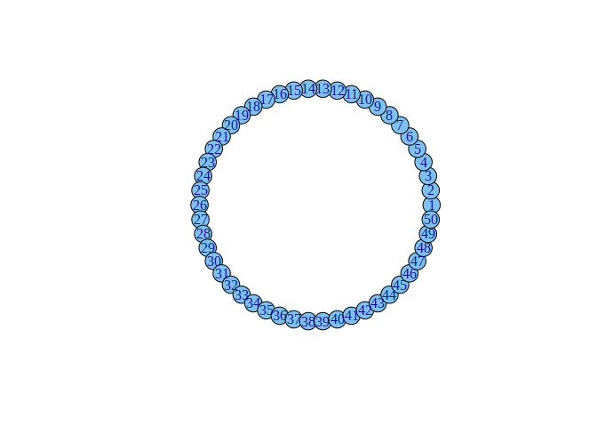
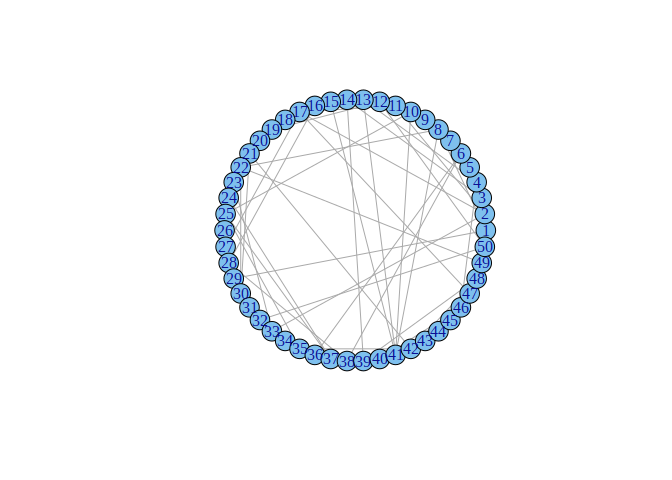

Real World Networks ii
======================

Small-World Networks (Watts & Strogatz, 1998)
---------------------------------------------

Example of generating a small-world network, starting from a regular
lattice.

    library(igraph)
    set.seed(1)

    # Create ring lattice
    g = graph.lattice(length=50, dim=1, nei=4, circular=TRUE)
    g$layout = layout.circle

    # Average path length and clustering coefficient
    average.path.length(g)

    ## [1] 3.571429

    transitivity(g)

    ## [1] 0.6428571

    plot(g)

    # Rewire edges
    g2 = rewire.edges(g, prob=0.1)
    average.path.length(g2)

    ## [1] 2.265306

    transitivity(g2)

    ## [1] 0.3618513

    plot(g2)

