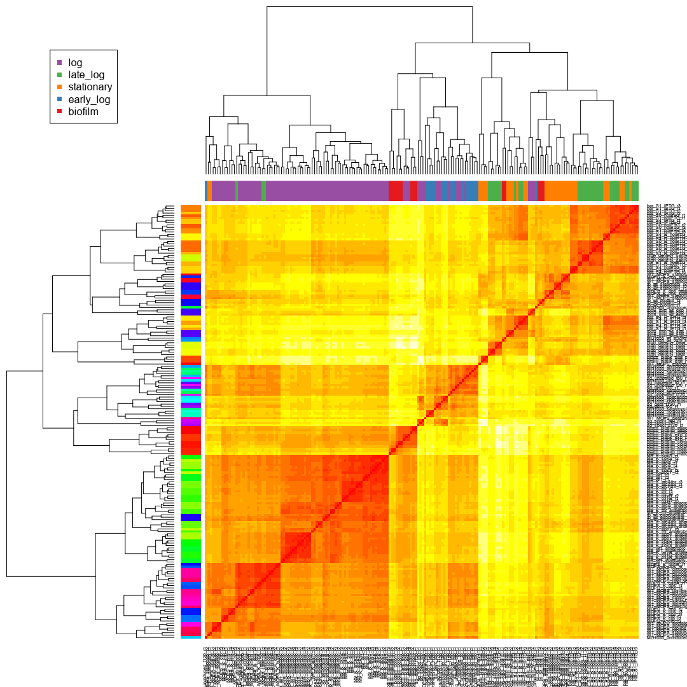

Many Microbe Microarrays Database (M3D) Data Preparation
========================================================

<a href='mailto:khughitt@umd.edu'>Keith Hughitt</a> (<time>2014-07-16</time>)

[view source](README.rmd)

Overview
========

Below we will load in some E. coli transcriptome data from the [Many Microbe Microarrays Database (M3D)](http://www.m3d.mssm.edu), and explore some basic properties of the data.

Hopefully, the code below will provide a good starting point for future R-based network analyses of the data.

The data included in this repo and used below comes M3D build 6, accessed on July 16, 2014. Currently, the gene only normalized version of the **E. coli** microarray data is used. In the future it may be worth analyzing the raw data and including probes for intergenic regions.

Methods
=======

Load libraries
--------------

``` {.r}
library(cbcbSEQ)
library(reshape2)
library(RColorBrewer)
library(dplyr)
library(gplots)
library(ggplot2)
```

Load data
---------

### Load feature data

To begin, let's load in some of the metadata which describes the sources and experimental conditions included in the microarray datasets.

``` {.r}
# load feature data
features_long = tbl_df(read.delim('input/E_coli_v4_Build_6.experiment_feature_descriptions'))
features_long = features_long %>% select(experiment_name, feature_name, value)

# remove any NA features (found one in above dataset)
features_long = features_long %>% filter(!is.na(feature_name))

# list of features included in datasets
unique(features_long$feature_name)
```

    ##  [1] aeration                      Ampicillin                   
    ##  [3] arabinose                     cell_density                 
    ##  [5] culture_shaking               culture_temperature          
    ##  [7] culture_type                  culture_vessel               
    ##  [9] culture_vessel_volume         culture_volume               
    ## [11] experimenter                  Norfloxacin                  
    ## [13] note                          peptone                      
    ## [15] perturbation                  perturbation_gene            
    ## [17] plasmid                       resistant_to                 
    ## [19] RNA_prep_type                 RNA_stop_solution            
    ## [21] sodium_chloride               strain                       
    ## [23] structured_metadata           yeast_extract                
    ## [25] note2                         time_point                   
    ## [27] ammonium_chloride             calcium_chloride             
    ## [29] disodium_hydrogen_phosphate   glucose                      
    ## [31] growth_phase                  magnesium_chloride           
    ## [33] potassium_phosphate_dibasic   ammonium_molybdate           
    ## [35] boric_acid                    cobalt_chloride              
    ## [37] culture_pH                    cupric_sulfate               
    ## [39] ferrous_sulfate               manganese(II)_chloride       
    ## [41] MOPS                          potassium_phosphate_monobasic
    ## [43] potassium_sulfate             thiamine_HCl                 
    ## [45] tricine                       zinc_sulfate                 
    ## [47] acetate                       glycerol                     
    ## [49] l-proline                     treatment_duration           
    ## [51] Ciprofloxacin                 curator_interpretation       
    ## [53] DNase_treatment               inoculum_dilution            
    ## [55] IPTG                          succinate                    
    ## [57] Kanamycin                     RNA_type                     
    ## [59] temperature_type              antifoam                     
    ## [61] culture_O2                    potassium_nitrate            
    ## [63] HOMOPIPES                     potassium_chloride           
    ## [65] tryptone                      o-phenanthroline             
    ## [67] Spectinomycin                 dimethylformamide            
    ## [69] indole                        serine_hydroxamate           
    ## [71] l-valine                      dilution_rate                
    ## [73] WTE                           gentamicin                   
    ## [75] aluminum_potassium_disulfate  ammonium_sulfate             
    ## [77] cobalt(II)_nitrate            copper(II)_chloride          
    ## [79] disodium_EDTA                 fructose                     
    ## [81] iron(II)_ammonium_sulfate     l-cysteine                   
    ## [83] magnesium_sulfate             nickel_chloride              
    ## [85] nicotinic_acid                sodium_selenite              
    ## [87] casamino_acids                cefsulodin                   
    ## [89] mecillinam                    chloramphenicol              
    ## [91] adenine                      
    ## 91 Levels: acetate adenine aeration ... zinc_sulfate

``` {.r}
# flatten feature data
feature_data = tbl_df(dcast(features_long, experiment_name ~ feature_name,
                            value.var="value"))
dim(feature_data)
```

    ## [1] 466  92

``` {.r}
# not all of the features are guaranteed to be covered for a given sample. This
# means that there will be a number of NAs in the data:
feature_data[1:5,1:5]
```

    ## Source: local data frame [5 x 5]
    ## 
    ##    experiment_name acetate adenine        aeration
    ## 1 acid_shift_10min      NA      NA assumed_aerobic
    ## 2  acid_shift_1min      NA      NA assumed_aerobic
    ## 3  acid_shift_5min      NA      NA assumed_aerobic
    ## 4    acid_shift_t0      NA      NA assumed_aerobic
    ## 5       ast_pBAD18      NA      NA assumed_aerobic
    ## Variables not shown: aluminum_potassium_disulfate (chr)

``` {.r}
# which features which have values set for every sample?
features = colnames(feature_data)
features[complete.cases(t(feature_data))]
```

    ## [1] "experiment_name" "aeration"        "experimenter"    "strain"

``` {.r}
# distribution of strains
head(sort(table(feature_data$strain), decreasing=TRUE), 10)
```

    ## 
    ##                  MG1655             MG1655_yale                 BW25113 
    ##                     149                      75                      40 
    ##                    EMG2                     K12 MG1063 (recA56 = recA-) 
    ##                      18                      18                      16 
    ##        BW25113deltaRecA                   W3110                  MG1063 
    ##                      15                      12                      10 
    ##              BL21 (DE3) 
    ##                       8

This gives us a pretty good place to start. let's build a simplified design matrix including sample id, experiment (\~batch), and XXXX feature.

#### Limit to K12 MG1655 strain

For simplicity, let's focus for now on one strain:

-   [E. coli K12 MG1655](http://www.genome.wisc.edu/resources/strains.htm)

This is the most widely studied strain in the dataset and includes nearly half of all of the samples included in M3D.

``` {.r}
feature_data = feature_data %>% filter(strain %in% c('MG1655', 'MG1655_yale'))

# remove any features for which there are no longer any relevant samples
feature_data = feature_data[,features[colSums(!is.na(feature_data)) > 0]]
features = colnames(feature_data)

# number of samples remaining
nrow(feature_data)
```

    ## [1] 224

#### Explore features in dataset

Next, let's see which features are most commonly studied.

``` {.r}
# most common features
sort(colSums(!is.na(feature_data)), decreasing=TRUE)
```

    ##               experiment_name                      aeration 
    ##                           224                           224 
    ##                  experimenter                 RNA_prep_type 
    ##                           224                           224 
    ##                        strain               sodium_chloride 
    ##                           224                           221 
    ##             RNA_stop_solution           structured_metadata 
    ##                           220                           214 
    ##           culture_temperature                  culture_type 
    ##                           212                           188 
    ##                          note                culture_vessel 
    ##                           177                           165 
    ##                       peptone                 yeast_extract 
    ##                           164                           164 
    ##                culture_volume         culture_vessel_volume 
    ##                           161                           147 
    ##               culture_shaking                  cell_density 
    ##                           146                           127 
    ##                    time_point                  perturbation 
    ##                           118                            98 
    ##             perturbation_gene                  growth_phase 
    ##                            98                            86 
    ##                       plasmid                  resistant_to 
    ##                            84                            82 
    ##                    Ampicillin                   Norfloxacin 
    ##                            75                            71 
    ##                     arabinose                       glucose 
    ##                            69                            68 
    ##             ammonium_chloride              calcium_chloride 
    ##                            57                            57 
    ##            magnesium_chloride               DNase_treatment 
    ##                            57                            41 
    ##               ferrous_sulfate                  thiamine_HCl 
    ##                            41                            41 
    ##            ammonium_molybdate                    boric_acid 
    ##                            39                            39 
    ##               cobalt_chloride                cupric_sulfate 
    ##                            39                            39 
    ##        manganese(II)_chloride                          MOPS 
    ##                            39                            39 
    ## potassium_phosphate_monobasic             potassium_sulfate 
    ##                            39                            39 
    ##                       tricine                  zinc_sulfate 
    ##                            39                            39 
    ##             inoculum_dilution                    culture_pH 
    ##                            37                            33 
    ##                         note2   potassium_phosphate_dibasic 
    ##                            28                            20 
    ##   disodium_hydrogen_phosphate                          IPTG 
    ##                            18                            15 
    ##                      antifoam                    culture_O2 
    ##                            13                            13 
    ##                     Kanamycin              o-phenanthroline 
    ##                            13                             8 
    ##            treatment_duration                    cefsulodin 
    ##                             7                             6 
    ##                    mecillinam                 Spectinomycin 
    ##                             6                             6 
    ##            serine_hydroxamate                    gentamicin 
    ##                             4                             3 
    ##              temperature_type              ammonium_sulfate 
    ##                             3                             2 
    ##                casamino_acids                 Ciprofloxacin 
    ##                             2                             2 
    ##                      l-valine             magnesium_sulfate 
    ##                             2                             2 
    ##                      RNA_type                       acetate 
    ##                             2                             1 
    ##                       adenine                      glycerol 
    ##                             1                             1 
    ##                     l-proline                     succinate 
    ##                             1                             1

``` {.r}
# temperature
table(as.numeric(feature_data$culture_temperature))
```

    ## 
    ##  30  37  42  50 
    ##   3 197   9   3

``` {.r}
# time
# we would need to normalize the units before making any comparisons here
table(feature_data$time_point)
```

    ## 
    ##     0  1080   110    12   120   135  1440   150  1560   180    20   225 
    ##    16     1     3     1    11     1     4     2     1     5     8     1 
    ##    24   240   270    30   300   330    36   360    40   405  4320    48 
    ##     2     4     1    10     1     1     1     1     4     1     1     1 
    ##   480     5    -5    60   720 86400    90 
    ##     2     4     4    20     2     1     3

``` {.r}
# cell density
table(feature_data$cell_density)
```

    ## 
    ##  0.1  0.2  0.3 0.35  0.4    1 11.5 13.2  1.5  2.2 
    ##    1   22   81    8    8    1    2    1    2    1

``` {.r}
# growth phase
table(feature_data$growth_phase)
```

    ## 
    ##    biofilm  early_log   late_log        log stationary 
    ##          6         17         10         40         13

Growth phase exploration
------------------------

Let's start by looking at growth phase since there is a large number of samples with known growth phase information and the number of samples in each phase is decent.

``` {.r}
# discard samples with no growth phase information
feature_data = feature_data[!is.na(feature_data$growth_phase),]

# drop other unrelated features (for now...)
feature_data = feature_data %>% select(experiment_name, experimenter,
                                       growth_phase, strain)
rownames(feature_data) = 1:nrow(feature_data)
```

#### Sample design

``` {.r}
kable(feature_data)
```

|experiment\_name|experimenter|growth\_phase|strain|
|:---------------|:-----------|:------------|:-----|
|bform\_biofilm\_attachment|Ito A|biofilm|MG1655|
|bform\_biofilm\_colony|Ito A|biofilm|MG1655|
|bform\_biofilm\_maturation|Ito A|biofilm|MG1655|
|bform\_plank\_exp|Ito A|log|MG1655|
|bform\_plank\_stat|Ito A|stationary|MG1655|
|har\_S0\_noIPTG|Haddadin FT|late\_log|MG1655|
|har\_S0\_R\_noIPTG|Haddadin FT|late\_log|MG1655|
|har\_S1\_IPTG|Haddadin FT|late\_log|MG1655|
|har\_S1\_noIPTG|Haddadin FT|late\_log|MG1655|
|har\_S1\_R\_IPTG|Haddadin FT|late\_log|MG1655|
|har\_S1\_R\_noIPTG|Haddadin FT|late\_log|MG1655|
|har\_S4\_IPTG|Haddadin FT|stationary|MG1655|
|har\_S4\_noIPTG|Haddadin FT|stationary|MG1655|
|har\_S4\_R\_IPTG|Haddadin FT|stationary|MG1655|
|har\_S4\_R\_noIPTG|Haddadin FT|stationary|MG1655|
|high\_density\_heat\_shock|Haddadin FT|late\_log|MG1655|
|high\_density\_heat\_shock\_IPTG|Haddadin FT|late\_log|MG1655|
|high\_density\_serine\_hydrox\_t1|Haddadin FT|late\_log|MG1655|
|M9\_K\_appY|Covert MW|log|MG1655|
|M9\_K\_appY\_anaerobic|Covert MW|log|MG1655|
|M9\_K\_arcA|Covert MW|log|MG1655|
|M9\_K\_arcA\_anaerobic|Covert MW|log|MG1655|
|M9\_K\_arcAfnr|Covert MW|log|MG1655|
|M9\_K\_arcAfnr\_anaerobic|Covert MW|log|MG1655|
|M9\_K\_fnr|Covert MW|log|MG1655|
|M9\_K\_fnr\_anaerobic|Covert MW|log|MG1655|
|M9\_K\_oxyR|Covert MW|log|MG1655|
|M9\_K\_oxyR\_anaerobic|Covert MW|log|MG1655|
|M9\_K\_soxS|Covert MW|log|MG1655|
|M9\_K\_soxS\_anaerobic|Covert MW|log|MG1655|
|M9\_WT|Covert MW|log|MG1655|
|M9\_WT\_anaerobic|Covert MW|log|MG1655|
|MG1063\_uninduced\_t180|Kohanski MA|early\_log|MG1655|
|MG1655\_ampicillin\_t120|Kohanski MA|early\_log|MG1655|
|MG1655\_ampicillin\_t30|Kohanski MA|early\_log|MG1655|
|MG1655\_ampicillin\_t60|Kohanski MA|early\_log|MG1655|
|MG1655\_kanamycin\_t120|Kohanski MA|early\_log|MG1655|
|MG1655\_kanamycin\_t30|Kohanski MA|early\_log|MG1655|
|MG1655\_kanamycin\_t60|Kohanski MA|early\_log|MG1655|
|MG1655\_norfloxacin\_t120|Kohanski MA|early\_log|MG1655|
|MG1655\_norfloxacin\_t30|Kohanski MA|early\_log|MG1655|
|MG1655\_norfloxacin\_t60|Kohanski MA|early\_log|MG1655|
|MG1655\_spectinomycin\_t120|Kohanski MA|early\_log|MG1655|
|MG1655\_spectinomycin\_t30|Kohanski MA|early\_log|MG1655|
|MG1655\_spectinomycin\_t60|Kohanski MA|early\_log|MG1655|
|MG1655\_uninduced\_t0|Kohanski MA|early\_log|MG1655|
|MG1655\_uninduced\_t120|Kohanski MA|early\_log|MG1655|
|MG1655\_uninduced\_t30|Kohanski MA|early\_log|MG1655|
|MG1655\_uninduced\_t60|Kohanski MA|early\_log|MG1655|
|MG1655\_wt\_24hr\_biofilm|Yang X|biofilm|MG1655|
|MG1655\_wt\_R1drd19\_24hr\_biofilm|Yang X|biofilm|MG1655|
|MOPS\_K\_crp|Allen TE|log|MG1655|
|MOPS\_K\_cspA|Allen TE|log|MG1655|
|MOPS\_K\_dps|Allen TE|log|MG1655|
|MOPS\_K\_dps\_stationary|Allen TE|stationary|MG1655|
|MOPS\_K\_dps\_stationary2|Allen TE|stationary|MG1655|
|MOPS\_K\_hns|Allen TE|log|MG1655|
|MOPS\_K\_hupB|Allen TE|log|MG1655|
|rb\_wt\_biofilm|Ito A|biofilm|MG1655|
|rb\_wt\_exponential|Ito A|log|MG1655|
|rb\_wt\_stationary|Ito A|stationary|MG1655|
|rpoS\_min\_wt\_exp|Dong T|log|MG1655|
|rpoS\_min\_wt\_stat|Dong T|stationary|MG1655|
|sg\_baseline\_t0|Kohanski M|log|MG1655|
|sg\_gent\_t120|Kohanski M|log|MG1655|
|sg\_gent\_t30|Kohanski M|log|MG1655|
|sg\_gent\_t60|Kohanski M|log|MG1655|
|sg\_spect\_t120|Kohanski M|log|MG1655|
|sg\_spect\_t30|Kohanski M|log|MG1655|
|sg\_spect\_t60|Kohanski M|log|MG1655|
|sg\_untreated\_t120|Kohanski M|log|MG1655|
|sg\_untreated\_t30|Kohanski M|log|MG1655|
|sg\_untreated\_t60|Kohanski M|log|MG1655|
|WT\_MOPS\_acetate|Allen TE|log|MG1655|
|WT\_MOPS\_acidShock|Allen TE|log|MG1655|
|WT\_MOPS\_cipro|Allen TE|log|MG1655|
|WT\_MOPS\_cipro2|Allen TE|log|MG1655|
|WT\_MOPS\_glucose|Allen TE|log|MG1655|
|WT\_MOPS\_glycerol|Allen TE|log|MG1655|
|WT\_MOPS\_heatShock|Allen TE|log|MG1655|
|WT\_MOPS\_lateLog|Allen TE|late\_log|MG1655|
|WT\_MOPS\_proline|Allen TE|log|MG1655|
|WT\_MOPS\_stationary|Allen TE|stationary|MG1655|
|WT\_MOPS\_stationary2|Allen TE|stationary|MG1655|
|WT\_MOPS\_stationary3|Allen TE|stationary|MG1655|
|WT\_MOPS\_stationary4|Allen TE|stationary|MG1655|

``` {.r}
# load experiment data (includes experiment/replicate mapping)
experiment_data = tbl_df(read.delim('input/E_coli_v4_Build_6.experiment_descriptions'))
dim(experiment_data)
```

[1] 907 3

``` {.r}
# drop chips that are not related to our design
experiment_data = experiment_data %>% filter(experiment_name %in%
                                             feature_data$experiment_name)
dim(experiment_data)
```

[1] 184 3

``` {.r}
# design
design = data.frame(
    condition=feature_data$growth_phase[match(experiment_data$experiment_name,
                                              feature_data$experiment_name)],
    batch=experiment_data$experiment_name
)
```

That should be good for now. Now let's move onto the actual expression data.

### Load expression data

``` {.r}
# expression data
raw_data = tbl_df(read.delim('input/E_coli_v4_Build_6_chips907probes4297.tab.gz',
                             row.names=1))
dim(raw_data)
```

    ## [1] 4297  907

``` {.r}
raw_data = raw_data[,colnames(raw_data) %in% experiment_data$chip_name]
dim(raw_data)
```

    ## [1] 4297  184

### Helper functions

Before continuing, let's first load a few helper functions that will be useful in the downstream analysis...

``` {.r}
#
# Choose colors to use when plotting sample condition and batch
#
sample_plot_colors = function (condition, batch) {
    # Convert to factor if not already and remove any unused levels
    condition = factor(condition)
    batch = factor(batch)

    # Batch colors
    if (nlevels(batch) > 1) {
        if (nlevels(batch) <= 12) {
            rc=brewer.pal(12, "Set3")[as.integer(batch)]
        } else {
            rc=rainbow(nlevels(batch))[as.integer(batch)]
        }
    } else {
        rc = rep("green", length(batch))
    }

    # Condition colors
    if (nlevels(condition) > 1) {
        if (nlevels(condition) <= 9) {
            cc=brewer.pal(9,"Set1")[as.integer(condition)]
        } else {
            cc=tail(rainbow(nlevels(condition) +
                            nlevels(batch)),
                    nlevels(condition))[as.integer(condition)]
        }
    } else {
        cc =  rep("red",length(condition))
    }

    return(list("batch"=rc, "condition"=cc))
}

#
# Plot sample heatmap
#
plot_sample_heatmap = function (counts, condition, batch,
                                metric='dist', col='heat.colors') {
    # Compute euclidean distance or pearson correlation between samples
    if (metric == 'dist') {
        dists = dist(t(counts))
        mat = as.matrix( dists )
    } else if (metric == 'pearson') {
        mat = cor(counts)
    }

    # Select plot colors
    plot_colors = sample_plot_colors(condition, batch)

    # Heatmap plot
    hv = heatmap.2(mat, margin=c(6, 6), trace="none", key=FALSE, col=col,
                   RowSideColors=plot_colors$batch,
                   ColSideColors=plot_colors$condition)
    legend(x="topleft", legend=unique(condition),
           col=unique(plot_colors$condition), pch=15)
    #legend(x="topright", legend=unique(batch),
    #       col=unique(plot_colors$batch), pch=15)
}

#
# Plot sample PCA components
#
plot_sample_pca = function(counts, condition, batch, main="", axis1=1, axis2=2,
                           include_table=TRUE) {
    # PCA
    pca = makeSVD(counts)
    pcVar = round((pca$d^2) / sum(pca$d^2) * 100, 2)

    # X and Y axis labels
    xl = sprintf("PC%d: %.2f%% variance", axis1, pcVar[axis1])
    yl = sprintf("PC%d: %.2f%% variance", axis2, pcVar[axis2])

    # Create combined data frame
    pcaData = data.frame(SampleID=colnames(counts),
                         PC1=pca$v[,axis1], PC2=pca$v[,axis2],
                         Condition=condition, Batch=batch)

    # Plot specified principle components
    plt = ggplot(pcaData, aes(PC1, PC2, color=Condition, shape=Batch)) +
        geom_point(stat="identity",size=5) +
        #geom_text(aes(label=SampleID), angle=45, size=4,vjust=2) +
        xlab(xl) + ylab(yl) +
        ggtitle(sprintf("%s (PC%d vs. PC%d)", main, axis1, axis2)) +
        theme(axis.ticks=element_blank(), axis.text.x=element_text(angle=-90))
    print(plt)

    # Compute variance of each PC and how they correlate with batch and
    # condition
    if (nlevels(batch) > 1) {
        pcs = pcRes(pca$v, pca$d, condition, batch)
    } else {
        pcs = pcRes(pca$v, pca$d, condition)
    }
    rownames(pcs) = paste0("PC", rownames(pcs))

    kable(pcs)
}
```

### Samples

``` {.r}
plot_sample_pca(raw_data,
                condition=design$condition,
                batch=design$batch)
```

    ## Warning: The shape palette can deal with a maximum of 6 discrete values
    ## because more than 6 becomes difficult to discriminate; you have
    ## 86. Consider specifying shapes manually. if you must have them.
    ## Warning: Removed 166 rows containing missing values (geom_point).
    ## Warning: The shape palette can deal with a maximum of 6 discrete values
    ## because more than 6 becomes difficult to discriminate; you have
    ## 86. Consider specifying shapes manually. if you must have them.


||propVar|cumPropVar|cond.R2|batch.R2|
|:--|------:|---------:|------:|-------:|
|PC1|30.95|30.95|69.23|99.50|
|PC2|13.21|44.16|35.35|99.31|
|PC3|9.38|53.54|19.79|99.28|
|PC4|6.68|60.22|23.07|98.78|
|PC5|5.53|65.75|18.06|98.68|
|PC6|4.07|69.82|16.45|98.62|
|PC7|3.43|73.25|14.35|95.11|
|PC8|2.81|76.06|14.80|98.25|
|PC9|2.27|78.33|1.44|97.94|
|PC10|1.59|79.92|1.05|96.26|
|PC11|1.43|81.35|9.47|96.52|
|PC12|1.32|82.67|3.16|79.48|
|PC13|1.11|83.78|4.17|96.59|
|PC14|0.92|84.70|0.80|94.09|
|PC15|0.85|85.55|4.83|84.65|
|PC16|0.76|86.31|8.59|95.78|
|PC17|0.67|86.98|6.44|91.54|
|PC18|0.63|87.61|4.21|86.94|
|PC19|0.61|88.22|9.90|95.83|
|PC20|0.56|88.78|5.90|87.25|
|PC21|0.52|89.30|2.26|93.45|
|PC22|0.49|89.79|8.94|82.47|
|PC23|0.43|90.22|12.79|91.96|
|PC24|0.41|90.63|0.66|89.57|
|PC25|0.38|91.01|3.40|88.40|
|PC26|0.37|91.38|3.48|79.41|
|PC27|0.34|91.72|3.92|92.55|
|PC28|0.33|92.05|3.92|94.48|
|PC29|0.31|92.36|1.93|92.11|
|PC30|0.29|92.65|1.57|88.22|
|PC31|0.27|92.92|0.91|90.15|
|PC32|0.26|93.18|2.91|79.24|
|PC33|0.25|93.43|3.59|84.88|
|PC34|0.24|93.67|4.76|81.81|
|PC35|0.23|93.90|2.55|82.06|
|PC36|0.22|94.12|5.78|88.14|
|PC37|0.21|94.33|4.77|67.31|
|PC38|0.18|94.51|2.75|81.56|
|PC39|0.18|94.69|4.79|80.95|
|PC40|0.18|94.87|1.45|85.95|
|PC41|0.17|95.04|0.20|82.69|
|PC42|0.16|95.20|2.83|80.28|
|PC43|0.15|95.35|1.05|83.03|
|PC44|0.15|95.50|0.99|73.31|
|PC45|0.13|95.63|0.78|76.28|
|PC46|0.13|95.76|3.10|63.12|
|PC47|0.13|95.89|0.87|85.58|
|PC48|0.12|96.01|1.38|77.74|
|PC49|0.12|96.13|1.75|69.64|
|PC50|0.11|96.24|4.06|72.24|
|PC51|0.11|96.35|2.29|73.31|
|PC52|0.10|96.45|2.70|73.20|
|PC53|0.10|96.55|0.70|58.99|
|PC54|0.10|96.65|2.29|73.36|
|PC55|0.09|96.74|2.01|59.83|
|PC56|0.09|96.83|2.34|71.92|
|PC57|0.09|96.92|0.36|72.57|
|PC58|0.08|97.00|0.58|58.31|
|PC59|0.08|97.08|0.25|56.56|
|PC60|0.08|97.16|0.40|65.35|
|PC61|0.07|97.23|1.48|63.97|
|PC62|0.07|97.30|0.27|73.41|
|PC63|0.07|97.37|0.40|60.63|
|PC64|0.07|97.44|1.30|56.71|
|PC65|0.06|97.50|0.22|52.45|
|PC66|0.06|97.56|0.10|58.25|
|PC67|0.06|97.62|0.91|57.29|
|PC68|0.06|97.68|0.50|68.95|
|PC69|0.06|97.74|0.12|62.30|
|PC70|0.06|97.80|0.87|53.67|
|PC71|0.06|97.86|0.12|52.64|
|PC72|0.05|97.91|0.58|54.67|
|PC73|0.05|97.96|1.02|56.98|
|PC74|0.05|98.01|0.21|58.21|
|PC75|0.05|98.06|0.62|48.94|
|PC76|0.05|98.11|0.09|64.47|
|PC77|0.05|98.16|0.26|41.79|
|PC78|0.04|98.20|0.41|32.38|
|PC79|0.04|98.24|0.68|53.30|
|PC80|0.04|98.28|0.77|45.67|
|PC81|0.04|98.32|0.16|39.68|
|PC82|0.04|98.36|0.22|46.29|
|PC83|0.04|98.40|0.88|46.85|
|PC84|0.04|98.44|0.66|34.22|
|PC85|0.04|98.48|0.23|55.27|
|PC86|0.04|98.52|0.30|27.33|
|PC87|0.04|98.56|0.27|41.55|
|PC88|0.03|98.59|0.41|31.93|
|PC89|0.03|98.62|0.37|37.38|
|PC90|0.03|98.65|0.12|35.88|
|PC91|0.03|98.68|0.06|38.02|
|PC92|0.03|98.71|0.17|27.30|
|PC93|0.03|98.74|0.31|41.36|
|PC94|0.03|98.77|0.17|51.24|
|PC95|0.03|98.80|0.12|26.87|
|PC96|0.03|98.83|0.34|37.06|
|PC97|0.03|98.86|0.25|28.67|
|PC98|0.03|98.89|0.37|26.51|
|PC99|0.03|98.92|0.07|36.46|
|PC100|0.03|98.95|0.26|40.89|
|PC101|0.03|98.98|0.05|24.94|
|PC102|0.03|99.01|0.01|24.82|
|PC103|0.02|99.03|0.09|31.52|
|PC104|0.02|99.05|0.07|34.37|
|PC105|0.02|99.07|0.34|39.04|
|PC106|0.02|99.09|0.06|33.87|
|PC107|0.02|99.11|0.15|36.50|
|PC108|0.02|99.13|0.09|31.61|
|PC109|0.02|99.15|0.08|34.01|
|PC110|0.02|99.17|0.35|35.42|
|PC111|0.02|99.19|0.02|42.82|
|PC112|0.02|99.21|0.13|30.61|
|PC113|0.02|99.23|0.17|39.46|
|PC114|0.02|99.25|0.05|29.51|
|PC115|0.02|99.27|0.23|39.59|
|PC116|0.02|99.29|0.01|45.65|
|PC117|0.02|99.31|0.05|31.50|
|PC118|0.02|99.33|0.05|28.92|
|PC119|0.02|99.35|0.06|26.67|
|PC120|0.02|99.37|0.05|33.73|
|PC121|0.02|99.39|0.32|20.24|
|PC122|0.02|99.41|0.06|24.45|
|PC123|0.02|99.43|0.02|30.03|
|PC124|0.02|99.45|0.01|28.14|
|PC125|0.02|99.47|0.03|30.27|
|PC126|0.02|99.49|0.09|34.47|
|PC127|0.02|99.51|0.01|31.45|
|PC128|0.02|99.53|0.16|32.14|
|PC129|0.02|99.55|0.23|14.12|
|PC130|0.02|99.57|0.03|28.00|
|PC131|0.02|99.59|0.02|25.65|
|PC132|0.02|99.61|0.09|35.67|
|PC133|0.01|99.62|0.03|20.81|
|PC134|0.01|99.63|0.03|20.76|
|PC135|0.01|99.64|0.03|14.20|
|PC136|0.01|99.65|0.03|18.72|
|PC137|0.01|99.66|0.03|31.81|
|PC138|0.01|99.67|0.07|31.70|
|PC139|0.01|99.68|0.01|28.09|
|PC140|0.01|99.69|0.08|30.88|
|PC141|0.01|99.70|0.03|15.46|
|PC142|0.01|99.71|0.11|11.76|
|PC143|0.01|99.72|0.03|21.41|
|PC144|0.01|99.73|0.01|8.65|
|PC145|0.01|99.74|0.05|12.71|
|PC146|0.01|99.75|0.00|19.15|
|PC147|0.01|99.76|0.01|14.29|
|PC148|0.01|99.77|0.03|9.57|
|PC149|0.01|99.78|0.00|12.33|
|PC150|0.01|99.79|0.02|12.43|
|PC151|0.01|99.80|0.01|13.64|
|PC152|0.01|99.81|0.05|7.48|
|PC153|0.01|99.82|0.01|7.92|
|PC154|0.01|99.83|0.01|7.72|
|PC155|0.01|99.84|0.03|7.93|
|PC156|0.01|99.85|0.02|15.90|
|PC157|0.01|99.86|0.03|8.47|
|PC158|0.01|99.87|0.01|17.42|
|PC159|0.01|99.88|0.01|14.36|
|PC160|0.01|99.89|0.05|5.02|
|PC161|0.01|99.90|0.01|5.75|
|PC162|0.01|99.91|0.02|21.92|
|PC163|0.01|99.92|0.01|5.07|
|PC164|0.01|99.93|0.01|7.06|
|PC165|0.01|99.94|0.01|7.81|
|PC166|0.01|99.95|0.00|11.85|
|PC167|0.01|99.96|0.01|8.04|
|PC168|0.01|99.97|0.02|3.67|
|PC169|0.01|99.98|0.01|6.92|
|PC170|0.01|99.99|0.02|9.43|
|PC171|0.01|100.00|0.02|5.88|
|PC172|0.01|100.01|0.01|13.08|
|PC173|0.01|100.02|0.01|2.35|
|PC174|0.01|100.03|0.01|4.83|
|PC175|0.00|100.03|0.00|10.48|
|PC176|0.00|100.03|0.00|7.24|
|PC177|0.00|100.03|0.01|6.63|
|PC178|0.00|100.03|0.00|1.59|
|PC179|0.00|100.03|0.00|2.75|
|PC180|0.00|100.03|0.00|2.74|
|PC181|0.00|100.03|0.01|1.59|
|PC182|0.00|100.03|0.00|1.24|
|PC183|0.00|100.03|0.00|2.53|

``` {.r}
plot_sample_heatmap(raw_data, design$condition, design$batch)
```



System Information
------------------

``` {.r}
sessionInfo()
```

    ## R version 3.1.0 (2014-04-10)
    ## Platform: x86_64-unknown-linux-gnu (64-bit)
    ## 
    ## locale:
    ##  [1] LC_CTYPE=en_US.UTF-8       LC_NUMERIC=C              
    ##  [3] LC_TIME=en_US.UTF-8        LC_COLLATE=en_US.UTF-8    
    ##  [5] LC_MONETARY=en_US.UTF-8    LC_MESSAGES=en_US.UTF-8   
    ##  [7] LC_PAPER=en_US.UTF-8       LC_NAME=C                 
    ##  [9] LC_ADDRESS=C               LC_TELEPHONE=C            
    ## [11] LC_MEASUREMENT=en_US.UTF-8 LC_IDENTIFICATION=C       
    ## 
    ## attached base packages:
    ## [1] stats     graphics  grDevices utils     datasets  methods   base     
    ## 
    ## other attached packages:
    ##  [1] knitcitations_0.6-2   RefManageR_0.8.2      bibtex_0.3-6         
    ##  [4] ggplot2_1.0.0         gplots_2.14.0         dplyr_0.2            
    ##  [7] RColorBrewer_1.0-5    reshape2_1.4          cbcbSEQ_0.9.1        
    ## [10] sva_3.10.0            mgcv_1.7-29           nlme_3.1-117         
    ## [13] preprocessCore_1.26.1 corpcor_1.6.6         limma_3.20.8         
    ## [16] knitr_1.6.5           rmarkdown_0.2.49      knitrBootstrap_1.0.0 
    ## [19] setwidth_1.0-3        colorout_1.0-3        vimcom_1.0-0         
    ## 
    ## loaded via a namespace (and not attached):
    ##  [1] assertthat_0.1     bitops_1.0-6       caTools_1.17      
    ##  [4] colorspace_1.2-4   digest_0.6.4       evaluate_0.5.5    
    ##  [7] formatR_0.10       gdata_2.13.3       grid_3.1.0        
    ## [10] gtable_0.1.2       gtools_3.4.1       htmltools_0.2.4   
    ## [13] httr_0.3           KernSmooth_2.23-12 labeling_0.2      
    ## [16] lattice_0.20-29    lubridate_1.3.3    magrittr_1.0.1    
    ## [19] markdown_0.7       MASS_7.3-31        Matrix_1.1-3      
    ## [22] memoise_0.2.1      mime_0.1.1         munsell_0.4.2     
    ## [25] parallel_3.1.0     plyr_1.8.1         proto_0.3-10      
    ## [28] Rcpp_0.11.2        RCurl_1.95-4.1     RJSONIO_1.2-0.2   
    ## [31] scales_0.2.4       stringr_0.6.2      tools_3.1.0       
    ## [34] XML_3.98-1.1       xtable_1.7-3       yaml_2.1.13

``` {.r}
date()
```

    ## [1] "Wed Jul 16 23:07:59 2014"

References
----------

-   J. J. Faith, M. E. Driscoll, V. A. Fusaro, E. J. Cosgrove, B. Hayete, F. S. Juhn, S. J. Schneider, T. S. Gardner, (2007) Many Microbe Microarrays Database: Uniformly Normalized Affymetrix Compendia With Structured Experimental Metadata. <em>Nucleic Acids Research</em> <strong>36</strong> D866-D870 <a href="http://dx.doi.org/10.1093/nar/gkm815">10.1093/nar/gkm815</a>
